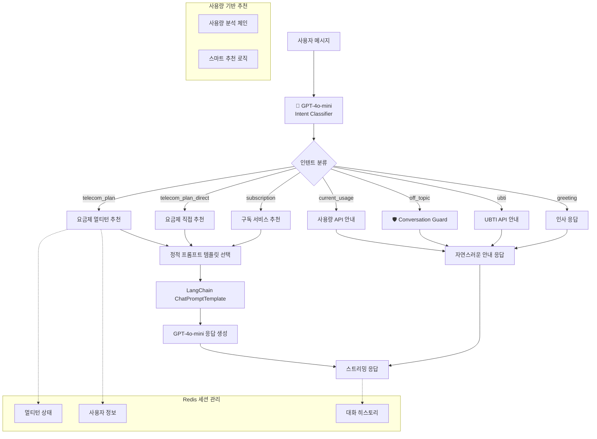

# 📡 Enhanced Template-based LangChain System AI v2.0

**LG U+ 요금제/구독 서비스 추천 AI 대화 시스템**

OpenAI GPT-4o-mini + LangChain + FastAPI + Redis 기반으로 구축된 **AI 기반 인텐트 감지**와 **자연스러운 대화 가드레일**을 탑재한 Template-based 대화 AI입니다.

4단계 멀티턴 플로우를 통해 사용자 성향을 파악하고, 개인 맞춤형 서비스를 자연스럽게 추천합니다.

[MoonuZ](https://github.com/Ureca-Middle-Project-Team4) 프로젝트의 AI 대화 엔진으로 개발되었습니다.


## 주요 기능

### **AI 기반 스마트 인텐트 감지**
기존의 단순 키워드 매칭을 넘어서 **GPT-4o-mini**를 활용한 정확한 의도 파악

| 입력 예시 | v1.0 (기존) | v2.0 (Enhanced) |
|-----------|-------------|-----------------|
| "리액트 추천해줘" | 요금제 멀티턴 시작 😑 | 오프토픽 자연스러운 안내 😊 |
| "파이썬 코딩 알려줘" | 요금제 질문 1단계 😑 | 전문 분야 안내 + 대안 제시 😊 |
| "3만원대 무제한" | 멀티턴 4단계 😑 | 바로 추천 😊 |

### 🛡️ **자연스러운 대화 가드레일**
전문 분야를 벗어난 질문에도 부드럽고 친근하게 응답
```python
# 무너 톤 오프토픽 응답 예시
"앗! 그것도 궁금하긴 한데 🤔
나는 요금제랑 구독 전문가라서 그쪽은 잘 몰라!
대신 요금제나 구독 서비스 추천은 맡겨줘~ 🐙💜"
```

### 📊 **사용량 기반 스마트 추천**
현재 요금제 사용 패턴을 AI가 분석하여 **4가지 추천 타입** 제공
- **🔥 upgrade**: 사용량 90%+ → 상위 요금제 권장
- **✅ maintain**: 사용량 70-90% → 현재 유지 권장
- **💰 downgrade**: 사용량 30%↓ → 절약형 추천
- **🎯 alternative**: 사용 패턴 맞춤 대안 제시

### 🌍 **완벽한 크로스 플랫폼 지원**
Windows, macOS, Linux 모든 운영체제에서 **원클릭 설치**


## 🚀 초간단 실행 방법

### **🖥️ Windows 사용자**
```cmd
git clone https://github.com/Ureca-Middle-Project-Team4/4EVER0-AI
cd 4EVER0-AI
setup.bat
run.bat
```

### **🍎 macOS/Linux 사용자**
```bash
git clone https://github.com/Ureca-Middle-Project-Team4/4EVER0-AI
cd 4EVER0-AI
chmod +x setup.sh run.sh
./setup.sh
./run.sh
```

### **⚙️ 개발자 수동 설치**
```bash
# 1. 프로젝트 클론
git clone https://github.com/Ureca-Middle-Project-Team4/4EVER0-AI
cd chatbot-server

# 2. 가상환경 생성 및 활성화
python3 -m venv venv
source venv/bin/activate  # Windows: venv\Scripts\activate

# 3. 패키지 설치
pip install -r requirements.txt
# 윈도우: pip install -r requirements-windows.txt

# 4. .env 설정

# 5. Redis 시작
redis-server

# 6. 서버 실행
python run.py
```

## 주요 기능

> **Template-based Conversational AI**로 RAG 대비 빠른 응답속도와 일관된 품질을 제공하면서도 **자연스러운 대화**를 구현합니다.

### **템플릿 기반 아키텍처 + AI 인텐트**
- **Instant Response**: RAG 벡터 검색 과정 없이 바로 응답 생성
- **Smart Intent Detection**: GPT-4o-mini 기반 정확한 의도 파악
- **Consistent Quality**: 사전 검증된 프롬프트로 일관된 결과 보장
- **Natural Conversation**: 오프토픽 질문에도 자연스러운 응답

### **멀티턴 대화 관리**
- **Structured Flow**: 4단계 필수 진행으로 정확한 정보 수집
- **Session Persistence**: 대화 중단 시에도 컨텍스트 유지
- **Redis-based Storage**: TTL 30분으로 효율적 메모리 관리
- **Smart Flow Control**: AI가 멀티턴 vs 직접 추천 자동 판단

### **스트리밍 응답 최적화**
- **Differentiated Latency**: 질문 0.05초, AI 응답 0.01초
- **Natural User Experience**: 실제 타이핑 패턴 모방
- **Async Processing**: FastAPI 기반 동시 다중 사용자 지원

### **페르소나 기반 응답**
- **Dual Character System**: 전문 상담원과 친근한 어시스턴트 중 선택 가능
- **User-tailored Tone**: 사용자 선호에 따른 톤 변경
- **Context Aware**: 상황에 맞는 자연스러운 응답


## Tech Stack

| 항목 | 내용 |
|------|------|
| **Language** | Python 3.9 |
| **Framework** | FastAPI |
| **AI Engine** | OpenAI GPT (gpt-4o-mini) |
| **AI Pipeline** | **LangChain Template-based Chain** |
| **Session Management** | Redis (TTL 1800초) |
| **ORM / DB** | SQLAlchemy (ORM), MySQL |
| **환경 관리** | .env, python-dotenv |
| **백엔드 연동** | Spring Boot (RestTemplate) |


**📄 API 문서:**
- [Swagger Docs](http://localhost:8000/docs)
- [ReDoc Docs](http://localhost:8000/redoc)


##  API 간단 가이드

### **메인 채팅 & 서비스 추천**
```bash
POST /api/chat                 # AI 인텐트 기반 스마트 채팅
POST /api/chat/likes          # 좋아요 브랜드 기반 추천
POST /api/usage/recommend     # 사용중인 요금제 기반 맞춤 추천
GET  /api/usage/{user_id}    # 현재 사용량 조회
```

### **UBTI 성향 분석 (타코시그널) **
```bash
POST /api/ubti/question       # UBTI 4단계 질문 진행
POST /api/ubti/result        # 최종 성향 분석 결과 출력용
```

### **시스템 정보**
```bash
GET  /                       # API 소개 및 기능 목록
GET  /health                 # 서버 상태 확인
GET  /api/status            # 서비스별 상태 체크 
GET  /debug/session/{id}    # 세션 디버깅 (개발용)
```


## 📁 폴더 구조

```
chatbot-server/
├── app/
│   ├── api/              # FastAPI 라우터
│   │   ├── chat.py       # 채팅/추천 API
│   │   ├── ubti.py       # UBTI 성향 분석 API
│   │   ├── chat_like.py  # 좋아요 기반 추천 API
│   │   └── usage.py      # 사용량 기반 추천 API
│   ├── chains/           # LangChain 체인 구성
│   │   ├── chat_chain.py # 멀티턴 체인 로직
│   │   ├── ubti_chain.py # UBTI 분석 체인
│   │   └── usage_chain.py # 사용량 분석 체인
│   ├── db/               # 데이터베이스
│   │   ├── models.py     # User 모델 추가
│   │   ├── plan_db.py    # 요금제 정보
│   │   ├── subscription_db.py # 구독 서비스 정보
│   │   ├── brand_db.py   # 브랜드 정보
│   │   ├── ubti_types_db.py # UBTI 타입 정보
│   │   └── user_usage_db.py # 사용량 DB 접근
│   ├── prompts/          # 정적 프롬프트 템플릿
│   │   ├── base_prompt.py     # 확장된 기본 템플릿
│   │   ├── plan_prompt.py     # 요금제 추천 템플릿
│   │   ├── subscription_prompt.py # 구독 추천 템플릿
│   │   ├── like_prompt.py     # 좋아요 기반 템플릿
│   │   ├── ubti_prompt.py     # UBTI 분석 템플릿
│   │   └── usage_prompt.py    # 사용량 기반 프롬프트
│   ├── schemas/          # Request/Response 모델
│   │   ├── chat.py       # 채팅 관련 스키마
│   │   ├── ubti.py       # UBTI 관련 스키마
│   │   └── usage.py      # 사용량 관련 스키마
│   ├── services/         # 비즈니스 로직
│   │   ├── handle_chat.py # 강화된 채팅 핸들러
│   │   ├── handle_chat_likes.py # 좋아요 기반 핸들러
│   │   └── handle_ubti.py # UBTI 핸들러
│   ├── utils/            # 유틸리티
│   │   ├── intent_classifier.py # AI 인텐트 분류기
│   │   ├── conversation_guard.py # 대화 가드레일
│   │   ├── intent.py     # 인텐트 통합 관리
│   │   ├── langchain_client.py # LangChain 클라이언트
│   │   └── redis_client.py  # Redis 세션 관리
│   └── main.py           # 업데이트된 FastAPI 진입점
├── requirements.txt       # 기존 의존성
├── requirements-windows.txt # Windows 최적화
├── setup.sh              # Linux/macOS 설치
├── setup.bat             # Windows 설치
├── run.sh                # Linux/macOS 실행
└── run.bat               # Windows 실행
```


## 시스템 아키텍처

### **Enhanced AI-Powered Conversational Architecture**




## 프롬프트 템플릿 설계 및 구조

### **Enhanced Template-based Chain 동작 원리**

> **AI 기반 인텐트 분류 + 템플릿 선택**: 사용자의 발화를 GPT-4o-mini가 정확히 분류한 후, 인텐트(`telecom_plan`)와 선호 톤(`general`, `muneoz`)에 따라 미리 정의된 프롬프트 템플릿을 선택하여 LLM 체인을 구성합니다.

```python
# 1. AI 기반 인텐트 분류
intent = await classify_intent(user_message)  # GPT-4o-mini 활용

# 2. 인텐트별 프롬프트 템플릿 정의
PLAN_PROMPTS = {
    "telecom_plan": {
        "general": """당신은 LG유플러스 요금제 전문가입니다.
        [수집된 사용자 정보] {user_info}
        [요금제 목록] {plans}
        추천해주세요.""",
        
        "muneoz": """야! 나는 요금제 추천하는 무너야! 🤟
        [네가 말해준 정보] {user_info}  
        [요금제들] {plans}
        완전 찰떡인 거 추천해줄게~"""
    }
}

# 3. 가드레일 처리
if intent == "off_topic":
    response = await handle_off_topic(user_message, tone)
    
# 4. LangChain 템플릿 생성 및 체인 실행
chain = get_prompt_template(intent, tone) | llm
response = await chain.astream(context)
```


## 🔧 Redis 세션 관리

### **멀티턴 상태 저장 구조**

```json
{
  "session_id": "user_123",
  "phone_plan_flow_step": 2,
  "user_info": {
    "data_usage": "무제한",
    "call_usage": "적게 사용"
  },
  "history": [
    {"role": "user", "content": "요금제 추천해줘"},
    {"role": "assistant", "content": "데이터 얼마나 쓰는 편이야? 🤟"},
    {"role": "user", "content": "무제한으로 쓰고 싶어"},
    {"role": "assistant", "content": "통화는 얼마나 해? 📞"}
  ]
}
```

### **세션 라이프사이클**

```mermaid
stateDiagram-v2
    [*] --> AI_인텐트_분류
    AI_인텐트_분류 --> {멀티턴_필요?}
    {멀티턴_필요?} --> 새_세션_생성: Yes
    {멀티턴_필요?} --> 직접_응답: No
    새_세션_생성 --> 멀티턴_시작
    멀티턴_시작 --> 1단계_질문
    1단계_질문 --> 2단계_질문
    2단계_질문 --> 3단계_질문
    3단계_질문 --> 4단계_질문
    4단계_질문 --> 최종_추천
    최종_추천 --> 세션_초기화
    직접_응답 --> 세션_초기화
    세션_초기화 --> [*]
    
    note right of AI_인텐트_분류
        GPT-4o-mini 기반
        정확한 의도 파악
    end note
    
    note right of 멀티턴_시작
        Redis TTL: 30분
        4단계 플로우 진행
    end note
```


## 배포 및 운영

### **환경별 설정**

#### **개발 환경**
```bash
python run.py
# 또는
uvicorn app.main:app --reload --host 0.0.0.0 --port 8000
```

#### **헬스체크 엔드포인트**
```bash
# 서버 상태 확인
curl http://localhost:8000/health

# API 서비스별 상태
curl http://localhost:8000/api/status

# 세션 디버깅 (개발용)
curl http://localhost:8000/debug/session/test_session_id
```
