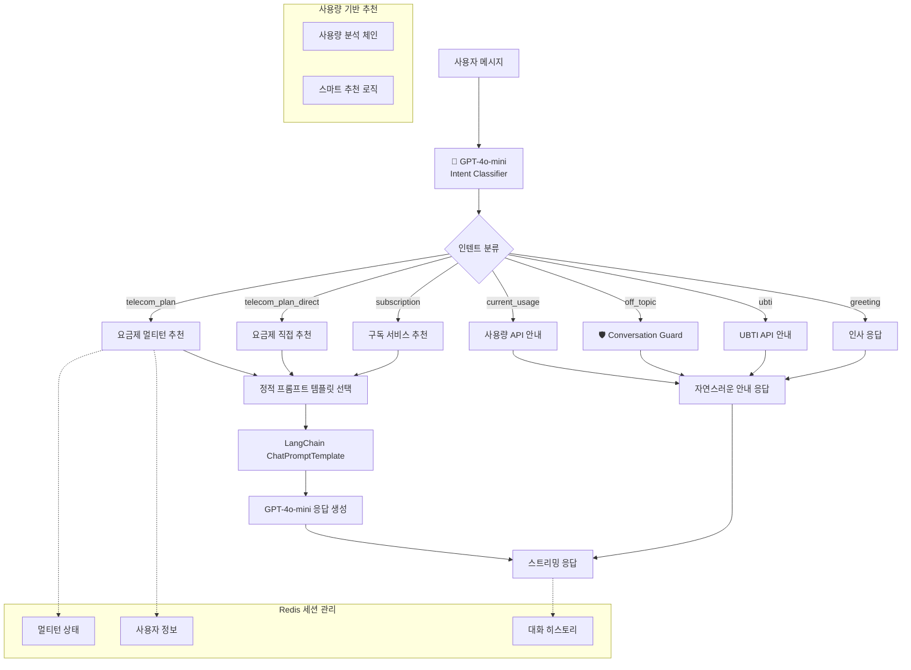

# 📡 Enhanced Template-based LangChain System AI v2.0

**LG U+ 요금제/구독 서비스 추천 AI 대화 시스템**

OpenAI GPT-4o-mini + LangChain + FastAPI + Redis 기반으로 구축된 **AI 기반 인텐트 감지**와 **자연스러운 대화 가드레일**을 탑재한 Template-based 대화 AI입니다.

4단계 멀티턴 플로우를 통해 사용자 성향을 파악하고, 개인 맞춤형 서비스를 자연스럽게 추천합니다.

[MoonuZ](https://github.com/Ureca-Middle-Project-Team4) 프로젝트의 AI 대화 엔진으로 개발되었습니다.


## 초간단 실행 방법

### **Windows 사용자**
```cmd
git clone https://github.com/Ureca-Middle-Project-Team4/4EVER0-AI
cd 4EVER0-AI
setup.bat
run.bat
```

### **macOS/Linux 사용자**
```bash
git clone https://github.com/Ureca-Middle-Project-Team4/4EVER0-AI
cd 4EVER0-AI
chmod +x setup.sh run.sh
./setup.sh
./run.sh
```

### **⚙개발자 수동 설치**
```bash
# 1. 프로젝트 클론
git clone https://github.com/Ureca-Middle-Project-Team4/4EVER0-AI
cd chatbot-server

# 2. 가상환경 생성 및 활성화
python3 -m venv venv
source venv/bin/activate  # Windows: venv\Scripts\activate

# 3. 패키지 설치
pip install -r requirements.txt
# 윈도우: pip install -r requirements-windows.txt

# 4. .env 설정

# 5. Redis 시작
redis-server

# 6. 서버 실행
python run.py
# 또는
uvicorn app.main:app --reload --host 0.0.0.0 --port 8000
```

## 주요 기능

> **Template-based Conversational AI**로 RAG 대비 빠른 응답속도와 일관된 품질을 제공하면서도 **자연스러운 대화**를 구현합니다.

### **템플릿 기반 아키텍처 + AI 인텐트**
- **Instant Response**: RAG 벡터 검색 과정 없이 바로 응답 생성
- **Smart Intent Detection**: GPT-4o-mini 기반 정확한 의도 파악
- **Consistent Quality**: 사전 검증된 프롬프트로 일관된 결과 보장
- **Natural Conversation**: 오프토픽 질문에도 자연스러운 응답

### **멀티턴 대화 관리**
- **Structured Flow**: 4단계 필수 진행으로 정확한 정보 수집
- **Session Persistence**: 대화 중단 시에도 컨텍스트 유지
- **Redis-based Storage**: TTL 30분으로 효율적 메모리 관리
- **Smart Flow Control**: AI가 멀티턴 vs 직접 추천 자동 판단

### **스트리밍 응답 최적화**
- **Differentiated Latency**: 질문 0.05초, AI 응답 0.01초
- **Natural User Experience**: 실제 타이핑 패턴 모방
- **Async Processing**: FastAPI 기반 동시 다중 사용자 지원

### **페르소나 기반 응답**
- **Dual Character System**: 전문 상담원과 친근한 어시스턴트 중 선택 가능
- **User-tailored Tone**: 사용자 선호에 따른 톤 변경
- **Context Aware**: 상황에 맞는 자연스러운 응답


## Tech Stack

| 항목 | 내용 |
|------|------|
| **Language** | Python 3.9 |
| **Framework** | FastAPI |
| **AI Engine** | OpenAI GPT (gpt-4o-mini) |
| **AI Pipeline** | **LangChain Template-based Chain** |
| **Session Management** | Redis (TTL 1800초) |
| **ORM / DB** | SQLAlchemy (ORM), MySQL |
| **환경 관리** | .env, python-dotenv |
| **백엔드 연동** | Spring Boot (RestTemplate) |


**📄 API 문서:**
- [Swagger Docs](http://localhost:8000/docs)
- [ReDoc Docs](http://localhost:8000/redoc)


## 📁 폴더 구조

```
// chatbot-server
app/
├── api/              # FastAPI 라우터
│   ├── chat.py       # 메인 채팅
│   ├── ubti.py       # UBTI 분석
│   └── usage.py      # 사용량 추천
├── prompts/          # AI 프롬프트 템플릿
│   ├── base_prompt.py
│   ├── plan_prompt.py
│   └── ubti_prompt.py
├── utils/            # 핵심 유틸리티
│   ├── intent_classifier.py  # AI 인텐트 분류
│   ├── conversation_guard.py # 대화 가드레일
│   └── redis_client.py       # 세션 관리
└── db/               # 데이터베이스
```


## 시스템 아키텍처

### **Enhanced AI-Powered Conversational Architecture**



## 🔧 Redis 세션 관리

### **세션 라이프사이클**

```mermaid
stateDiagram-v2
    [*] --> AI_인텐트_분류
    AI_인텐트_분류 --> {멀티턴_필요?}
    {멀티턴_필요?} --> 새_세션_생성: Yes
    {멀티턴_필요?} --> 직접_응답: No
    새_세션_생성 --> 멀티턴_시작
    멀티턴_시작 --> 1단계_질문
    1단계_질문 --> 2단계_질문
    2단계_질문 --> 3단계_질문
    3단계_질문 --> 4단계_질문
    4단계_질문 --> 최종_추천
    최종_추천 --> 세션_초기화
    직접_응답 --> 세션_초기화
    세션_초기화 --> [*]
    
    note right of AI_인텐트_분류
        GPT-4o-mini 기반
        정확한 의도 파악
    end note
    
    note right of 멀티턴_시작
        Redis TTL: 30분
        4단계 플로우 진행
    end note
```


## 배포 및 운영

### **헬스체크 엔드포인트**
```bash
# 서버 상태 확인
curl http://localhost:8000/health

# API 서비스별 상태
curl http://localhost:8000/api/status

# 세션 디버깅 (개발용)
curl http://localhost:8000/debug/session/test_session_id
```
