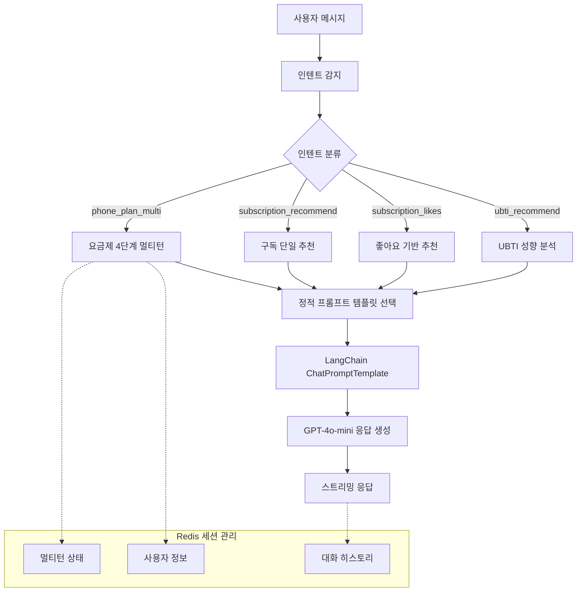
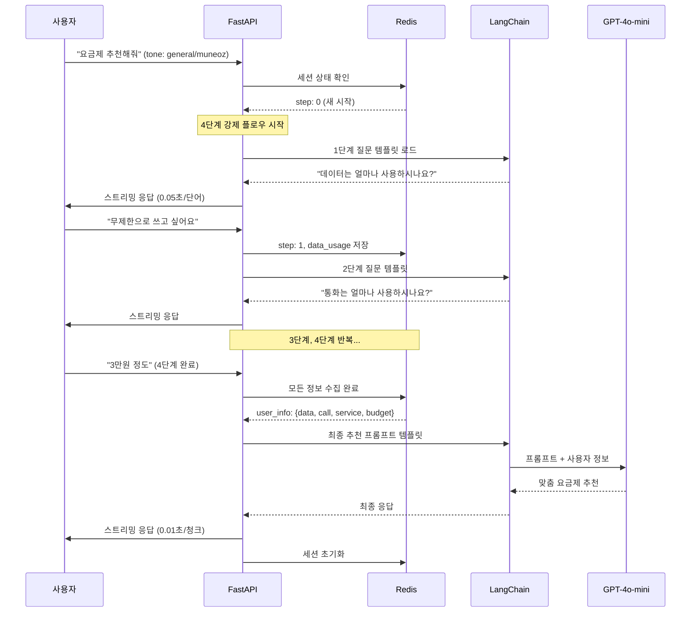
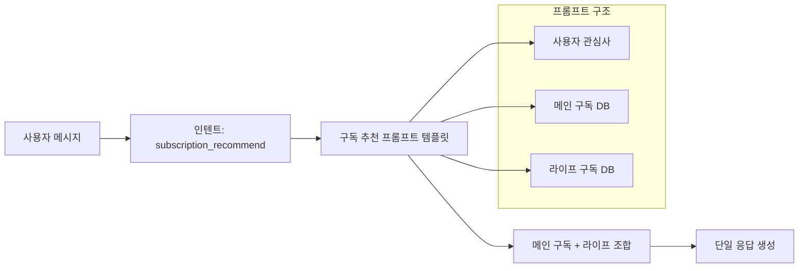
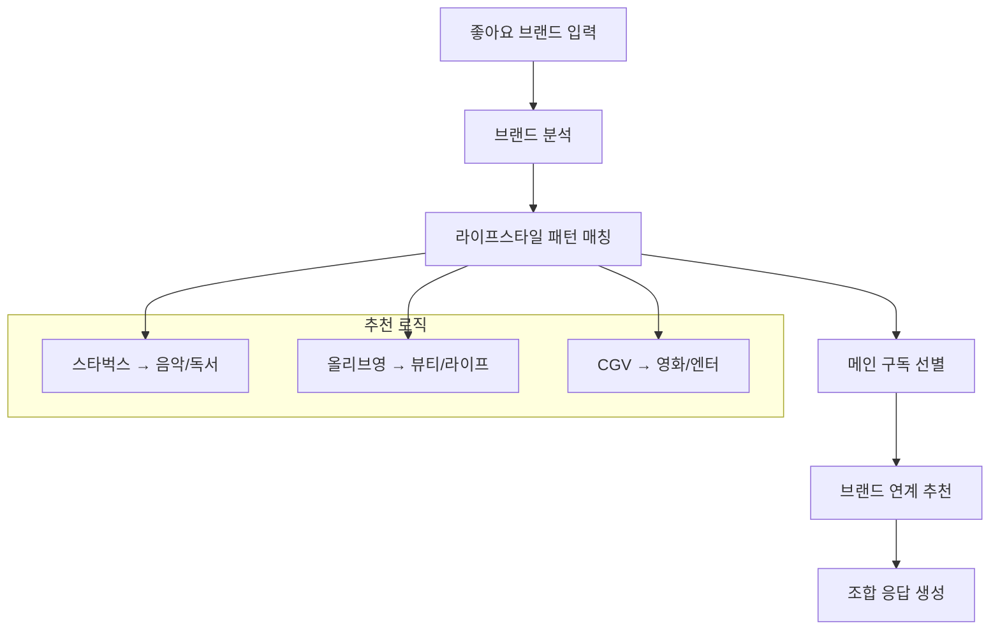
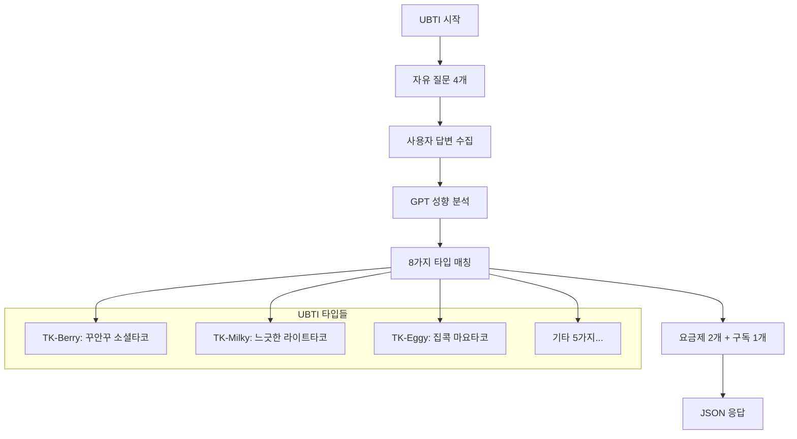
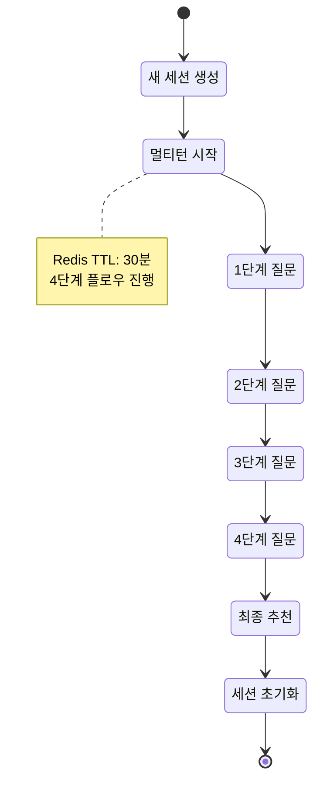

# 📡 Template-based LangChain System AI

**LG U+ 요금제/구독 서비스 추천 AI 대화 시스템**

OpenAI + LangChain + FastAPI + Redis 기반으로 구축된 Template-based 대화 AI입니다.
4단계 멀티턴 플로우를 통해 사용자 성향을 파악하고, 개인 맞춤형 서비스를 추천합니다.

[MoonuZ](https://github.com/Ureca-Middle-Project-Team4) 프로젝트의 AI 대화 엔진으로 개발되었습니다.

## 주요 기능

> **Template-based Conversational AI**로 RAG 대비 빠른 응답속도와 일관된 품질을 제공합니다.

### **템플릿 기반 아키텍처**
- **Instant Response**: RAG 벡터 검색 과정 없이 바로 응답 생성
- **Consistent Quality**: 사전 검증된 프롬프트로 일관된 결과 보장
- **Lightweight Structure**: 복잡한 임베딩 및 검색 과정 제거

### **멀티턴 대화 관리**
- **Structured Flow**: 4단계 필수 진행으로 정확한 정보 수집
- **Session Persistence**: 대화 중단 시에도 컨텍스트 유지
- **Redis-based Storage**: TTL 30분으로 효율적 메모리 관리

### **스트리밍 응답 최적화**
- **Differentiated Latency**: 질문 0.05초, AI 응답 0.01초
- **Natural User Experience**: 실제 타이핑 패턴 모방
- **Async Processing**: FastAPI 기반 동시 다중 사용자 지원

### **페르소나 기반 응답**
- **Dual Character System**: 전문 상담원과 친근한 어시스턴트 중 선택 가능
- **User-tailored Tone**: 사용자 선호에 따른 톤 변경

## 실행 방법

```bash
# 1. 프로젝트 클론
git clone https://github.com/Ureca-Middle-Project-Team4/4EVER0-AI
cd chatbot-server

# 2. 가상환경 생성 및 활성화
python3 -m venv venv
source venv/bin/activate  # Windows: venv\Scripts\activate

# 3. 패키지 설치
pip install -r requirements.txt

# 4. .env 설정
echo "OPENAI_API_KEY=sk-xxxxxxxxxxxx" > .env

# 5. 서버 실행
uvicorn app.main:app --reload --host 0.0.0.0 --port 8000
```

## Tech Stack

| 항목 | 내용 |
|------|------|
| **Language** | Python 3.9 |
| **Framework** | FastAPI |
| **AI Engine** | OpenAI GPT (gpt-4o-mini) |
| **AI Pipeline** | **LangChain Template-based Chain** |
| **Session Management** | Redis (TTL 1800초) |
| **ORM / DB** | SQLAlchemy (ORM), MySQL |
| **환경 관리** | .env, python-dotenv |
| **백엔드 연동** | Spring Boot (RestTemplate) |


**📄 API 문서:**

> 배포 예정입니다.

- [Swagger Docs](http://localhost:8000/docs)
- [ReDoc Docs](http://localhost:8000/redoc)

## 📁 폴더 구조

```
chatbot-server/
├── app/
│   ├── api/              # FastAPI 라우터
│   │   ├── chat.py       # 채팅/추천 API
│   │   └── ubti.py       # UBTI 성향 분석 API
│   ├── chains/           # LangChain 체인 구성
│   │   ├── chat_chain.py # 멀티턴 체인 로직
│   │   └── ubti_chain.py # UBTI 분석 체인
│   ├── db/               # Mock 데이터베이스
│   │   ├── plans.py      # 요금제 정보
│   │   └── subscriptions.py # 구독 서비스 정보
│   ├── prompts/          # 정적 프롬프트 템플릿
│   │   ├── base_prompt.py     # 기본 톤별 템플릿
│   │   ├── plan_prompt.py     # 요금제 추천 템플릿
│   │   ├── subscription_prompt.py # 구독 추천 템플릿
│   │   └── ubti_prompt.py     # UBTI 분석 템플릿
│   ├── schemas/          # Request/Response 모델
│   ├── services/         # 비즈니스 로직
│   │   ├── intent.py     # 인텐트 감지
│   │   └── handle_chat.py # 채팅 플로우 관리
│   ├── utils/            # 유틸리티
│   │   └── session.py    # Redis 세션 관리
│   └── main.py           # FastAPI 진입점
```


## 시스템 아키텍처

### **Template-based Conversational AI 구조**



## 🔍 주요 기능 소개 및 API 플로우

### 1. 📱 **요금제 멀티턴 추천** (`POST /api/chat`)

**Intent:** `phone_plan_multi`



> **4단계 질문 플로우**
1. **데이터 사용량**: "5GB, 무제한, 많이 사용해요"
2. **통화 사용량**: "거의 안해요, 1시간 정도, 많이 해요"  
3. **서비스 사용**: "유튜브, 게임, SNS, 업무용"
4. **예산 범위**: "3만원대, 5만원 이하"

### 2. ☕ **구독 단일 추천** (`POST /api/chat`)

**Intent:** `subscription_recommend`



**응답 예시:**
```
고객님의 관심사를 보니 음악과 커피를 좋아하시는군요! 😊

✅ 추천 메인 구독
• 지니뮤직 - 9,900원
→ 무제한 음악 스트리밍으로 취향저격!

✅ 추천 라이프 구독  
• 스타벅스 쿠폰
→ 음악 들으며 카페 시간 완벽 조합!
```

### 3. 💜 **좋아요 기반 추천** (`POST /api/chat/likes`)



### 4. 🍡 **UBTI 성향 분석** (`POST /api/ubti/question`, `POST /api/ubti/result`)



## 페르소나 기반 캐릭터 선택 시스템

**🏢 General (전문 상담원)**
- 정중한 존댓말과 체계적인 상담
- "고객님께 맞는 요금제를 추천드리겠습니다"

**🤟 Muneoz (MZ 친구)**
- MZ세대 감성의 친근한 반말
- "야! 완전 찰떡인 거 추천해줄게~ 🔥"

> 사용자가 원하는 대화 스타일을 선택하여 개인화된 상담 경험 제공

**톤별 응답 예시:**
```javascript
// General 톤
{
  "message": "요금제 추천해줘",
  "tone": "general"
}
// 응답: "안녕하세요, 고객님! 😊 데이터는 얼마나 사용하시나요?"

// Muneoz 톤  
{
  "message": "요금제 추천해줘",
  "tone": "muneoz"
}
// 응답: "안뇽! 🤟 나는 무너야~ 🐙 데이터 얼마나 쓰는 편이야?"
```

## 프롬프트 템플릿 설계 및 구조

### **Template-based Chain 동작 원리**

> **인텐트별 프롬프트 템플릿**: 사용자의 발화 의도(`phone_plan_multi`)와 선호 톤(`general`, `muneoz`)에 따라 미리 정의된 프롬프트 템플릿을 선택하여 LLM 체인을 구성합니다.

```python
# 1. 인텐트별 프롬프트 템플릿 정의
PLAN_PROMPTS = {
    "phone_plan_multi": {
        "general": """당신은 LG유플러스 요금제 전문가입니다.
        [수집된 사용자 정보] {user_info}
        [요금제 목록] {plans}
        추천해주세요.""",
        
        "muneoz": """야! 나는 요금제 추천하는 무너야! 🤟
        [네가 말해준 정보] {user_info}  
        [요금제들] {plans}
        완전 찰떡인 거 추천해줄게~"""
    }
}

# 2. LangChain 템플릿 생성 및 체인 실행
chain = get_prompt_template(intent, tone) | llm
response = await chain.astream(context)

## 🔧 Redis 세션 관리

### **멀티턴 상태 저장 구조**

```json
{
  "session_id": "user_123",
  "history": [
    {"role": "user", "content": "요금제 추천해줘"},
    {"role": "assistant", "content": "데이터 얼마나 쓰는 편이야? 🤟"}
  ]
}
```
```

### **세션 라이프사이클**



