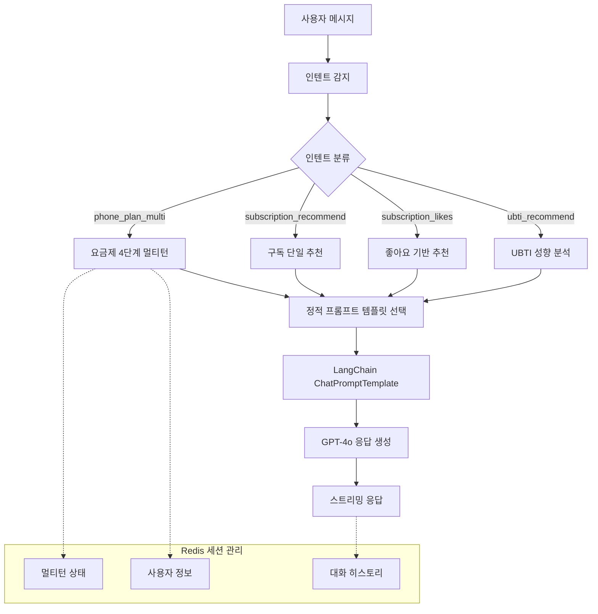
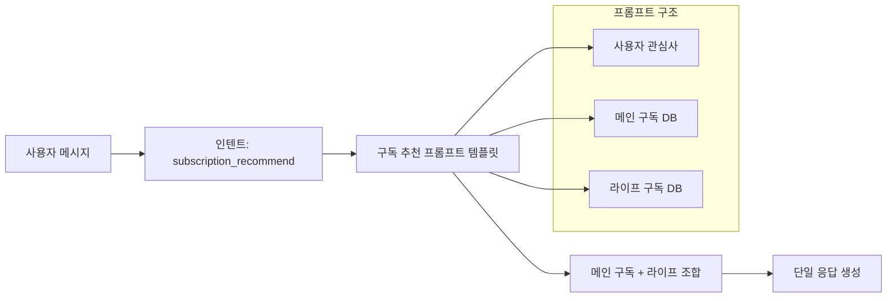
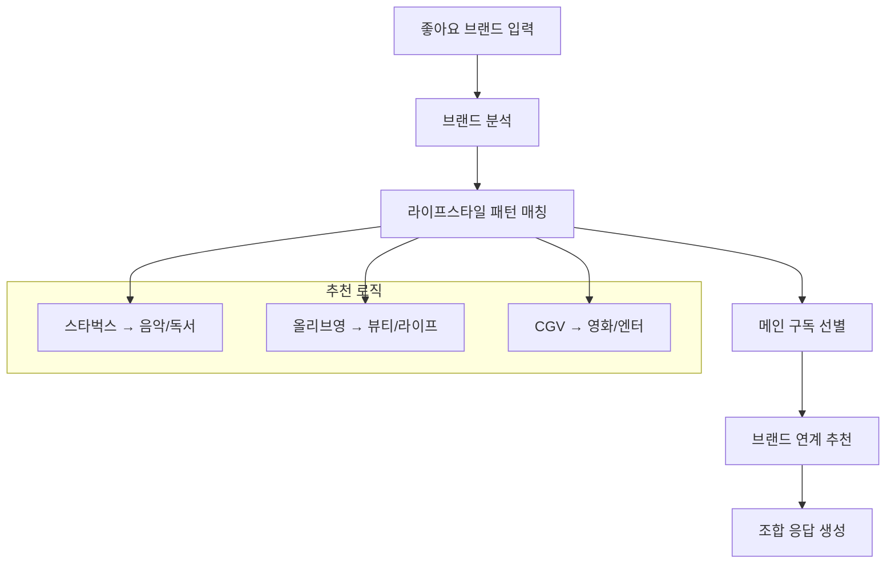
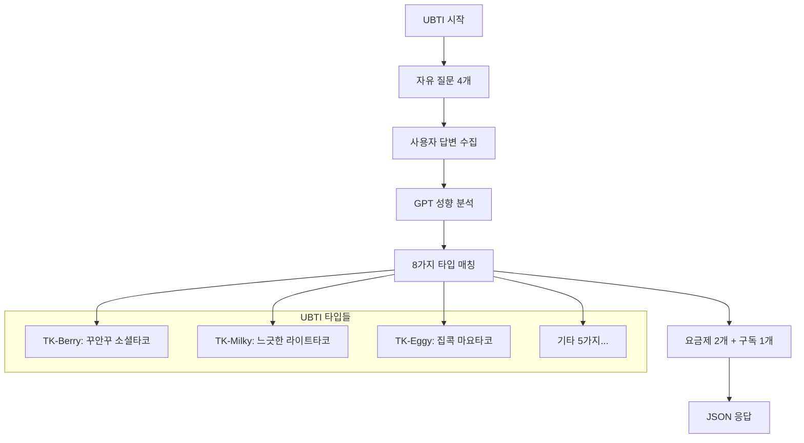

# 📡 Template-based LangChain System AI by MoonuZ

AI 기반 라이프스타일 큐레이션 플랫폼 **MoonuZ**를 위해 LG U+ 요금제/구독 서비스를 사용자 성향에 맞춰 자동 추천해주는 **Template-based LangChain System AI 대화 시스템**입니다.

OpenAI + LangChain + FastAPI + Redis로 **4단계 멀티턴 대화** 처리 및 **톤별 캐릭터 응답**을 제공합니다.

## 🧱 Tech Stack

| 항목 | 내용 |
|------|------|
| **Language** | Python 3.9 |
| **Framework** | FastAPI |
| **AI Engine** | OpenAI GPT (gpt-4o) |
| **AI Pipeline** | **LangChain Template-based Chain** |
| **Session Management** | Redis (TTL 1800초) |
| **ORM / DB** | SQLAlchemy (ORM), MySQL |
| **환경 관리** | .env, python-dotenv |
| **백엔드 연동** | Spring Boot (RestTemplate) |
| **구조화** | 정적 프롬프트 템플릿 + 인텐트 라우팅 |

## 🎯 시스템 아키텍처

### **Template-based Conversational AI 구조**



### **핵심 특징: Rule-driven Template System**

- ✅ **정적 프롬프트**: 미리 정의된 템플릿 기반 응답 생성
- ✅ **인텐트 라우팅**: 사용자 메시지 → 적절한 체인 선택
- ✅ **멀티턴 플로우**: 4단계 강제 질문으로 정보 수집
- ✅ **톤별 캐릭터**: general(상담원) vs muneoz(무너) 응답 스타일

## 🔍 주요 기능 및 API 플로우

### 1. 📱 **요금제 멀티턴 추천** (`POST /api/chat`)

**Intent:** `phone_plan_multi`


**4단계 질문 플로우:**
1. **데이터 사용량**: "5GB, 무제한, 많이 사용해요"
2. **통화 사용량**: "거의 안해요, 1시간 정도, 많이 해요"  
3. **서비스 사용**: "유튜브, 게임, SNS, 업무용"
4. **예산 범위**: "3만원대, 5만원 이하"

### 2. ☕ **구독 단일 추천** (`POST /api/chat`)

**Intent:** `subscription_recommend`



**응답 예시:**
```
고객님의 관심사를 보니 음악과 커피를 좋아하시는군요! 😊

✅ 추천 메인 구독
• 지니뮤직 - 9,900원
→ 무제한 음악 스트리밍으로 취향저격!

✅ 추천 라이프 구독  
• 스타벅스 쿠폰
→ 음악 들으며 카페 시간 완벽 조합!
```

### 3. 💜 **좋아요 기반 추천** (`POST /api/chat/likes`)



### 4. 🍡 **UBTI 성향 분석** (`POST /api/ubti/question`, `POST /api/ubti/result`)



## 🎭 톤별 캐릭터 시스템

> 챗봇 이용시 톤을 설정할 수 있습니다!

### **general vs muneoz 톤 비교**

| 구분 | General (상담원 스타일) | Muneoz (MZ 스타일) |
|------|------------------|---------------|
| **말투** | 정중한 존댓말 | MZ세대 반말 |
| **호칭** | "고객님" | "너", "친구" |
| **이모지** | 😊📱✅ | 🐙🤟💜🔥✨ |
| **응답 스타일** | 전문적, 친절 | MZ, 트렌디 |

**톤별 응답 예시:**
```javascript
// General 톤
{
  "message": "요금제 추천해줘",
  "tone": "general"
}
// 응답: "안녕하세요, 고객님! 😊 데이터는 얼마나 사용하시나요?"

// Muneoz 톤  
{
  "message": "요금제 추천해줘",
  "tone": "muneoz"
}
// 응답: "안뇽! 🤟 나는 무너야~ 🐙 데이터 얼마나 쓰는 편이야?"
```

## 📊 프롬프트 템플릿 구조

### **Template-based Chain 동작 원리**

> 인텐트별로 구분: 인텐트는 챗봇이나 앱에서 사용자의 요청을 이해하고 처리하기 위한 목적이나 의도를 의미합니다. 
`intent.py`에서 LLM은 해당 사용자의 발화 의도가 무엇인지에 따라 어떤 역할을 수행해야 할 지 생각합니다.

```python
# 1. 인텐트별 프롬프트 템플릿 정의
PLAN_PROMPTS = {
    "phone_plan_multi": {
        "general": """당신은 LG유플러스 요금제 전문가입니다.
        [수집된 사용자 정보] {user_info}
        [요금제 목록] {plans}
        추천해주세요.""",
        
        "muneoz": """야! 나는 요금제 추천하는 무너야! 🤟
        [네가 말해준 정보] {user_info}  
        [요금제들] {plans}
        완전 찰떡인 거 추천해줄게~"""
    }
}

# 2. LangChain 템플릿 생성
from langchain_core.prompts import ChatPromptTemplate

def get_prompt_template(intent: str, tone: str):
    prompt_text = PLAN_PROMPTS[intent][tone]
    return ChatPromptTemplate.from_template(prompt_text)

# 3. 체인 실행
chain = prompt_template | llm
response = await chain.astream(context)
```

## 🔧 Redis 세션 관리

### **멀티턴 상태 저장 구조**

```json
{
  "session_id": "user_123",
  "history": [
    {"role": "user", "content": "요금제 추천해줘"},
    {"role": "assistant", "content": "데이터 얼마나 쓰는 편이야? 🤟"}
    ...
  ]
}
```

### **세션 라이프사이클**


## 🚀 실행 방법

```bash
# 1. 프로젝트 클론
git clone https://github.com/Ureca-Middle-Project-Team4/4EVER0-AI
cd chatbot-server

# 2. 가상환경 생성 및 활성화
python3 -m venv venv
source venv/bin/activate  # Windows: venv\Scripts\activate

# 3. 패키지 설치
pip install -r requirements.txt

# 4. .env 설정
echo "OPENAI_API_KEY=sk-xxxxxxxxxxxx" > .env

# 5. Redis 실행 (Docker)
docker run -d -p 6379:6379 redis:alpine

# 6. 서버 실행
uvicorn app.main:app --reload --host 0.0.0.0 --port 8000
```

**📄 API 문서:**
- [Swagger Docs](http://localhost:8000/docs)
- [ReDoc Docs](http://localhost:8000/redoc)

## 📁 폴더 구조

```
chatbot-server/
├── app/
│   ├── api/              # FastAPI 라우터
│   │   ├── chat.py       # 채팅/추천 API
│   │   └── ubti.py       # UBTI 성향 분석 API
│   ├── chains/           # LangChain 체인 구성
│   │   ├── chat_chain.py # 멀티턴 체인 로직
│   │   └── ubti_chain.py # UBTI 분석 체인
│   ├── db/               # Mock 데이터베이스
│   │   ├── plans.py      # 요금제 정보
│   │   └── subscriptions.py # 구독 서비스 정보
│   ├── prompts/          # 정적 프롬프트 템플릿
│   │   ├── base_prompt.py     # 기본 톤별 템플릿
│   │   ├── plan_prompt.py     # 요금제 추천 템플릿
│   │   ├── subscription_prompt.py # 구독 추천 템플릿
│   │   └── ubti_prompt.py     # UBTI 분석 템플릿
│   ├── schemas/          # Request/Response 모델
│   ├── services/         # 비즈니스 로직
│   │   ├── intent.py     # 인텐트 감지
│   │   └── handle_chat.py # 채팅 플로우 관리
│   ├── utils/            # 유틸리티
│   │   └── session.py    # Redis 세션 관리
│   └── main.py           # FastAPI 진입점
```

## 🎬 사용 예시

### **멀티턴 요금제 추천**

```plaintext
👤 사용자: "요금제 추천해줘" (tone: muneoz)
🤖 무너: "안뇽! 🤟 데이터 얼마나 쓰는 편이야?"

👤 사용자: "무제한으로 쓰고 싶어"  
🤖 무너: "통화는 얼마나 해? 📞"

👤 사용자: "거의 안해"
🤖 무너: "주로 뭐 하면서 시간 보내? 💜"

👤 사용자: "유튜브랑 게임"
🤖 무너: "한 달에 얼마 정도 쓸 생각이야? 💰"

👤 사용자: "4만원 정도"
🤖 무너: "완전 찰떡인 요금제 찾았어! 🔥
        ✅ 5G 다이렉트 39 / 39,000원 / 무제한 / 기본통화
        → 데이터 무제한에 게임/영상 최적화! 💜"
```

### **구독 서비스 추천**

```plaintext
👤 사용자: "커피 좋아하는데 관련 구독 있어?" (tone: general)
🤖 상담원: "커피를 좋아하시는군요! 😊

          ✅ 추천 메인 구독
          • 지니뮤직 - 9,900원
          → 카페에서 음악과 함께 완벽한 조합

          ✅ 추천 라이프 구독  
          • 스타벅스 쿠폰
          → 매월 할인된 가격으로 커피 즐기세요!"
```

### **좋아요 기반 추천**

```plaintext
👤 사용자: "메가커피랑 CGV 좋아요 눌렀어요" (tone: muneoz)
🤖 무너: "야! 카페랑 영화 완전 좋아하는구나! 🎬☕

        ✅ 추천 메인 구독
        • U+모바일tv - 7,700원  
        → 이동 중에도 드라마/영화 무제한! 

        ✅ 추천 라이프 브랜드
        • 메가커피 쿠폰
        → 영화 보기 전 커피 한잔, 완전 찰떡! 💜"
```

### **UBTI 성향 분석**

```plaintext
👤 사용자: "혼자 집에서 넷플릭스 보는 걸 좋아해요"
🤖 시스템: UBTI 분석 중...

📱 결과: 
{
  "ubti_type": {
    "code": "TK-Eggy",
    "name": "집콕 마요타코",
    "emoji": "🥚"
  },
  "recommendation": {
    "plans": [
      {"name": "5G 슬림", "description": "집에서 영상 시청 최적화"},
      {"name": "LTE 34", "description": "가성비 스트리밍 요금제"}
    ],
    "subscription": {
      "name": "넷플릭스",  
      "description": "집콕 생활의 완벽한 파트너"
    }
  }
}
```

## 핵심 기술 특징

> **Vector DB 검색 기반 RAG가 아닌**, **정적 템플릿 기반의 효율적인 대화 AI**로 설계되어 빠르고 안정적인 사용자 경험을 제공합니다! 

### **Template-based Architecture**
- **정적 프롬프트**: RAG 없이 미리 정의된 템플릿 사용
- **빠른 응답**: 벡터 검색 없이 즉시 응답 생성  
- **일관된 품질**: 검증된 프롬프트로 안정적 결과

### **멀티턴 대화 플로우**
- **4단계 강제 진행**: 정확한 정보 수집하여 안정적 답변 보장
- **중간 이탈 방지**: 다른 메시지에도 플로우 유지
- **Redis 세션**: 안정적인 상태 관리

### **스트리밍 최적화**  
- **차별화된 속도**: 질문(0.05초) vs AI응답(0.01초)
- **자연스러운 UX**: 실제 타이핑하는 느낌
- **실시간 처리**: FastAPI 비동기 스트리밍

### **톤별 캐릭터**
- **상반된 성격**: 전문 상담원 ↔ 친근한 무너
- **MZ 감성 추구**: 트렌디한 언어와 이모지 활용

