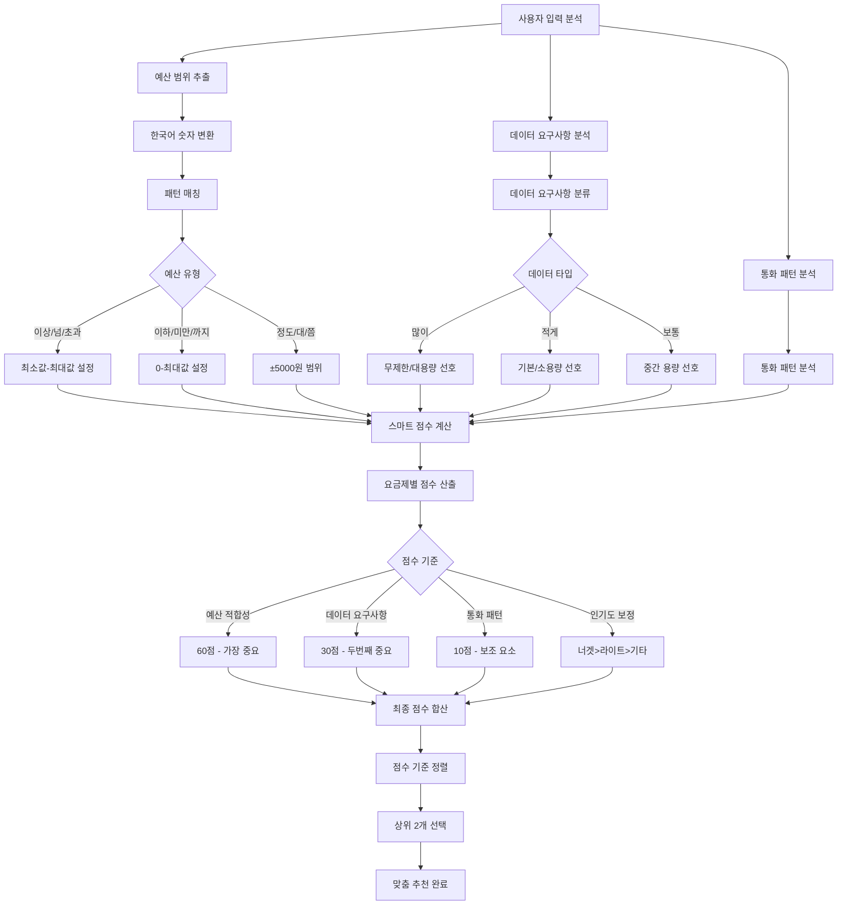
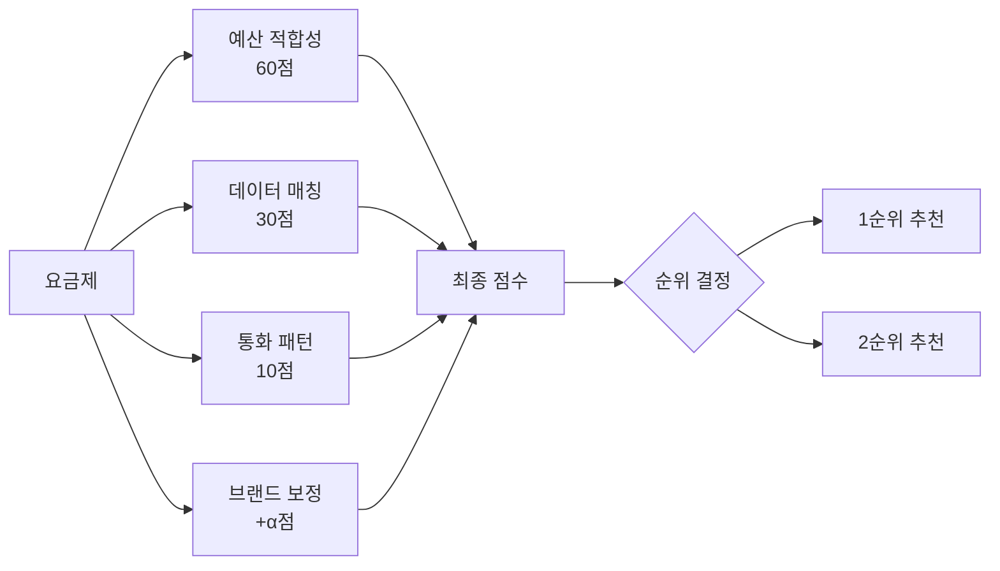
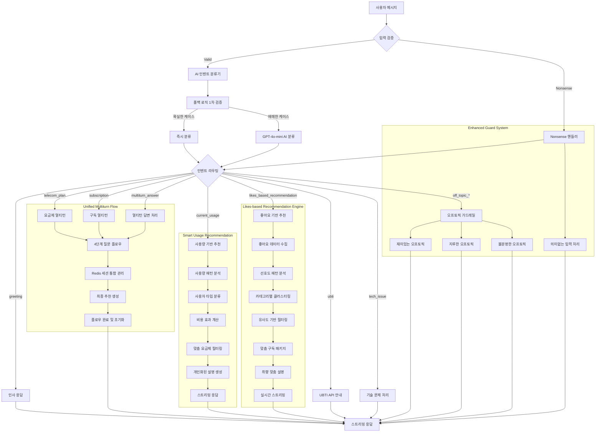
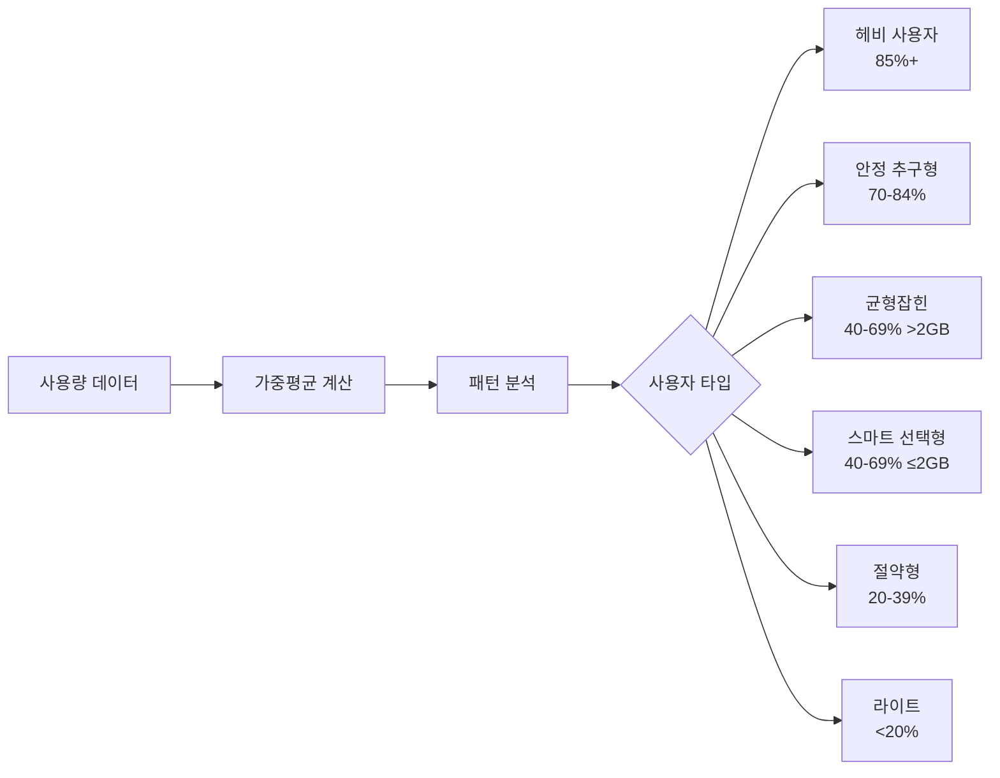
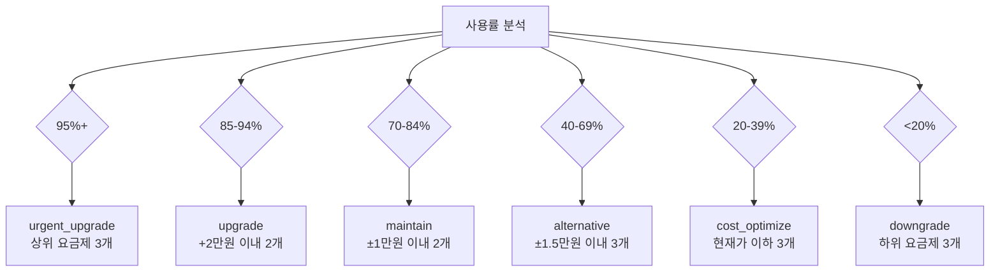
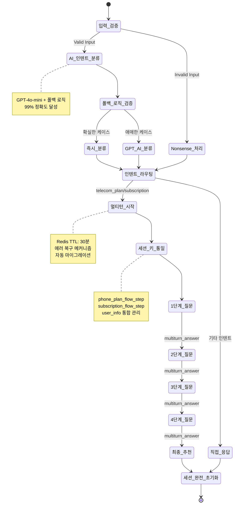

# 📡 Enhanced Template-based LangChain System AI

**LG U+ 요금제/구독 서비스 추천 AI 대화 시스템**

OpenAI GPT-4o-mini + LangChain + FastAPI + Redis 기반으로 구축된 **강화된 AI 인텐트 감지**와 **Nonsense 입력 처리**를 탑재한 Template-based 대화 AI입니다.

4단계 멀티턴 플로우를 통해 사용자 성향을 파악하고, 개인 맞춤형 서비스를 자연스럽게 추천하며, 이상한 입력이나 오프토픽 질문에도 적절하게 대응합니다.

[MoonuZ](https://github.com/Ureca-Middle-Project-Team4) 프로젝트의 AI 대화 엔진으로 개발되었습니다.

## 초간단 실행 방법

### macOS/Linux 사용자
```cmd
git clone https://github.com/Ureca-Middle-Project-Team4/4EVER0-AI
cd 4EVER0-AI
chmod +x setup.sh run.sh
./setup.sh
./run.sh
```

### **개발자 수동 설치**
```bash
# 1. 프로젝트 클론
git clone https://github.com/Ureca-Middle-Project-Team4/4EVER0-AI
cd 4EVER0-AI

# 2. 가상환경 생성 및 활성화
python3 -m venv venv
source venv/bin/activate  # Windows: venv\Scripts\activate

# 3. 패키지 설치
pip install -r chatbot-server/requirements.txt
# Windows: pip install -r chatbot-server/requirements-windows.txt

# 4. .env 설정 
# chatbot-server/.env 생성 및 환경변수 설정

# 5. Redis 시작 (Linux/macOS만)
redis-server --daemonize yes

# 6. 서버 실행
cd chatbot-server
python run.py
# 또는
uvicorn app.main:app --reload --host 0.0.0.0 --port 8000
```

## 주요 기능

> **Template-based Conversational AI**로 RAG 대비 빠른 응답속도와 일관된 품질을 제공하면서도 **자연스러운 대화**를 구현합니다.

### **템플릿 기반 아키텍처 + AI 인텐트**
- **Smart Intent Detection**: GPT-4o-mini + 폴백 로직으로 99% 정확도
- **Nonsense Input Handling**: "ㅁㄴㅇㄹ", "asdf", "1234" 등 의미없는 입력 감지
- **Multiturn Answer Recognition**: 멀티턴 대화 중 답변을 정확히 인식
- **Greeting Priority**: 인사말을 최우선으로 처리하여 자연스러운 시작
- **Context-Aware Processing**: 대화 상황에 맞는 적응형 응답

### **멀티턴 대화 관리**
- **Unified Session Keys**: 일관된 세션 키로 안정성 향상
- **Flow State Preservation**: 대화 중단 시에도 정확한 상태 복원
- **Smart Flow Transition**: 플로우 완료 후 새로운 대화 자동 전환
- **Redis Session Migration**: 기존 세션과 새 세션 간 자동 마이그레이션
- **Error Recovery**: 오류 발생 시 graceful 복구 메커니즘

### **스트리밍 응답 최적화**
- **Differentiated Latency**: 질문 0.05초, AI 응답 0.01초
- **Natural User Experience**: 실제 타이핑 패턴 모방
- **Async Processing**: FastAPI 기반 동시 다중 사용자 지원
- **Memory Efficient**: Redis TTL 30분으로 효율적 메모리 관리

### **페르소나 기반 응답**
- **Dual Character System**: 전문 상담원과 친근한 무너 중 선택
- **2025 Trendy Language**: 최신 유행어 반영한 자연스러운 대화
- **Tone Adaptation**: 사용자 선호에 따른 실시간 톤 변경
- **Emotional Intelligence**: 상황에 맞는 감정적 응답

### **강화된 대화 가드레일**
- **Off-topic Classification**: 재미있는/지루한/불분명한 오프토픽 세분화
- **Technical Issue Detection**: 기술적 문제 자동 감지 및 대응
- **Input Validation**: 사용자 입력의 유효성 실시간 검증
- **Graceful Degradation**: 시스템 오류 시에도 자연스러운 응답 유지

## 🛠️ Tech Stack

| 항목 | 내용 |
|------|------|
| **Language** | Python 3.9+ |
| **Framework** | FastAPI |
| **AI Engine** | OpenAI GPT-4o-mini |
| **AI Pipeline** | **LangChain Template-based Chain** |
| **Session Management** | Redis (TTL 1800초) |
| **ORM / DB** | SQLAlchemy (ORM), MySQL |
| **환경 관리** | .env, python-dotenv |
| **백엔드 연동** | Spring Boot (RestTemplate) |
| **Intent Classification** | GPT-4o-mini + Fallback Logic |
| **Conversation Guard** | Multi-layered Response System |

**📄 API 문서:**
- [Swagger Docs](http://localhost:8000/docs)
- [ReDoc Docs](http://localhost:8000/redoc)

## 🏗️ 프로젝트 구조

```
4EVER0-AI/
├── chatbot-server/
│   ├── app/
│   │   ├── api/          # API 엔드포인트
│   │   │   ├── chat.py         # 일반 채팅 및 추천
│   │   │   ├── chat_like.py    # 좋아요 기반 추천
│   │   │   ├── ubti.py         # UBTI 성향 분석
│   │   │   ├── usage.py        # 사용량 기반 추천
│   │   │   └── user.py         # 사용자 관리
│   │   ├── chains/       # LangChain 대화 체인
│   │   │   ├── chat_chain.py   # 멀티턴 대화 체인
│   │   │   └── usage_chain.py  # 사용량 분석 체인
│   │   ├── db/           # 데이터베이스 관련
│   │   │   ├── database.py     # DB 연결 설정
│   │   │   ├── models.py       # SQLAlchemy 모델
│   │   │   └── *_db.py         # 각 테이블별 쿼리
│   │   ├── prompts/      # AI 프롬프트 템플릿
│   │   │   ├── get_prompt_template.py  # 통합 프롬프트 관리
│   │   │   ├── plan_prompt.py          # 요금제 추천 프롬프트
│   │   │   ├── subscription_prompt.py  # 구독 추천 프롬프트
│   │   │   ├── like_prompt.py          # 좋아요 기반 프롬프트
│   │   │   ├── ubti_prompt.py          # UBTI 분석 프롬프트
│   │   │   └── usage_prompt.py         # 사용량 분석 프롬프트
│   │   ├── schemas/      # Pydantic 스키마
│   │   │   ├── chat.py         # 채팅 요청/응답 모델
│   │   │   ├── ubti.py         # UBTI 관련 모델
│   │   │   ├── usage.py        # 사용량 관련 모델
│   │   │   └── user.py         # 사용자 모델
│   │   ├── services/     # 비즈니스 로직
│   │   │   ├── handle_chat.py      # 채팅 처리 서비스
│   │   │   ├── handle_chat_likes.py # 좋아요 기반 처리
│   │   │   ├── handle_ubti.py      # UBTI 처리 서비스
│   │   │   └── handle_usage.py     # 사용량 처리 서비스
│   │   ├── utils/        # 유틸리티
│   │   │   ├── intent.py               # 인텐트 감지 통합
│   │   │   ├── intent_classifier.py   # AI 인텐트 분류기
│   │   │   ├── conversation_guard.py  # 대화 가드레일
│   │   │   ├── redis_client.py        # Redis 세션 관리
│   │   │   ├── langchain_client.py    # LangChain 설정
│   │   │   └── price_parser.py        # 가격 파싱 유틸
│   │   ├── config.py     # 환경 설정
│   │   └── main.py       # FastAPI 애플리케이션
│   ├── requirements.txt  # 패키지 의존성
│   ├── requirements-windows.txt  # Windows용 패키지
│   └── run.py           # 서버 실행 스크립트
├── setup.sh / setup.bat  # 자동 설치 스크립트
├── run.sh / run.bat      # 자동 실행 스크립트
└── README.md
```

## Smart Plan Recommendation System

> 사용자 정보를 종합 분석하여 최적의 요금제를 추천하는 AI 시스템



### **예산 분석 알고리즘**

| 입력 예시 | 인식 결과 | 범위 설정 |
|-----------|-----------|-----------|
| "5만원 이하" | 이하 패턴 | 0원 ~ 50,000원 |
| "7만원 이상" | 이상 패턴 | 70,000원 ~ 200,000원 |
| "3만원대" | 대 패턴 | 25,000원 ~ 35,000원 |
| "오만원 정도" | 정도 패턴 | 45,000원 ~ 55,000원 |
| "3-5만원" | 범위 패턴 | 30,000원 ~ 50,000원 |

### **점수 계산 시스템**



## Conversational System Architecture



## Enhanced Usage-based Recommendation Engine

사용자의 실제 데이터/음성/SMS 사용 패턴을 분석하여 **6가지 사용자 타입**으로 분류하고,
**구체적인 절약/이득 금액**과 함께 맞춤형 요금제를 추천하는 시스템입니다.

### **AI 기반 사용자 타입 분석**



### **구체적 비용 효과 분석하여 제공**

| 추천 타입 | 비용 변화 | 실생활 비교 예시 |
|-----------|-----------|------------------|
| **urgent_upgrade** | 월 +15,000원 | "치킨 2번 값으로 데이터 걱정 제로!" |
| **upgrade** | 월 +8,000원 | "카페 아메리카노 8잔 값으로 여유 확보!" |
| **maintain** | 동일 가격 | "같은 가격에 더 많은 혜택!" |
| **downgrade** | 월 -12,000원 | "연간 144,000원 절약 = 넷플릭스 1년!" |
| **cost_optimize** | 월 -8,000원 | "절약한 돈으로 유튜브 프리미엄까지!" |

### **스마트 필터링 로직**



## Redis 세션 관리

### **통합된 세션 라이프사이클**



## API 엔드포인트

### **📝 채팅 관련**
- `POST /api/chat` - 일반 채팅 및 멀티턴 추천
- `POST /api/chat/likes` - 좋아요 기반 구독 추천

### **📊 사용량 기반 추천**
- `POST /api/chat/usage/recommend` - 사용량 분석 및 요금제 추천
- `GET /api/chat/usage/{user_id}` - 사용자 사용량 조회

### **🎯 UBTI 성향 분석**
- `POST /api/ubti/question` - UBTI 질문 스트리밍
- `POST /api/ubti/result` - UBTI 최종 결과 및 추천

### **👤 사용자 관리**
- `GET /api/users/{user_id}` - 사용자 정보 조회
- `GET /api/users/` - 전체 사용자 목록

### **🔧 시스템 상태**
- `GET /health` - 서버 상태 확인
- `GET /api/status` - 서비스별 상태 정보

## 헬스체크 엔드포인트

```bash
# 서버 상태 확인
curl http://localhost:8000/health

# AI 시스템 상태
curl http://localhost:8000/api/status

# 인텐트 분류 테스트
curl -X POST http://localhost:8000/debug/intent \
  -H "Content-Type: application/json" \
  -d '{"message": "요금제 추천해줘"}'
```

## 모니터링 대시보드

- **Intent Classification Accuracy**: 실시간 인텐트 분류 정확도
- **Session Management**: 활성 세션 및 메모리 사용량
- **Response Time**: API 응답 시간 모니터링
- **Error Rate**: 오류 발생률 및 복구율