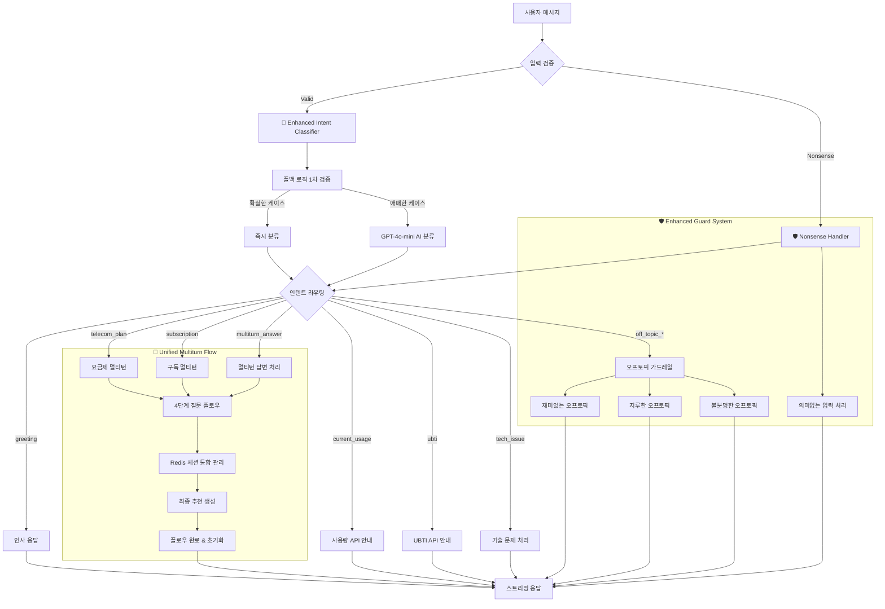
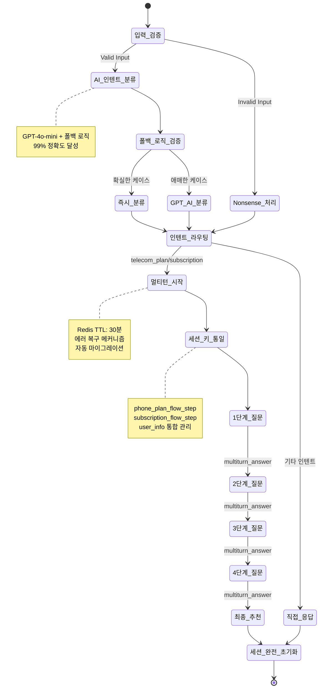

# 📡 Enhanced Template-based LangChain System AI

**LG U+ 요금제/구독 서비스 추천 AI 대화 시스템**

OpenAI GPT-4o-mini + LangChain + FastAPI + Redis 기반으로 구축된 **강화된 AI 인텐트 감지**와 **Nonsense 입력 처리**를 탑재한 Template-based 대화 AI입니다.

4단계 멀티턴 플로우를 통해 사용자 성향을 파악하고, 개인 맞춤형 서비스를 자연스럽게 추천하며, 이상한 입력이나 오프토픽 질문에도 적절하게 대응합니다.

[MoonuZ](https://github.com/Ureca-Middle-Project-Team4) 프로젝트의 AI 대화 엔진으로 개발되었습니다.


## 초간단 실행 방법

### **Windows 사용자**
```cmd
git clone https://github.com/Ureca-Middle-Project-Team4/4EVER0-AI
cd 4EVER0-AI
setup.bat
run.bat
```

###  macOS/Linux 사용자
```cmd
git clone https://github.com/Ureca-Middle-Project-Team4/4EVER0-AI
cd 4EVER0-AI
chmod +x setup.sh run.sh
./setup.sh
./run.sh
```

### **⚙개발자 수동 설치**
```bash
# 1. 프로젝트 클론
git clone https://github.com/Ureca-Middle-Project-Team4/4EVER0-AI
cd 4EVER0-AI

# 2. 가상환경 생성 및 활성화
python3 -m venv venv
source venv/bin/activate  # Windows: venv\Scripts\activate

# 3. 패키지 설치
pip install -r chatbot-server/requirements.txt
# Windows: pip install -r chatbot-server/requirements-windows.txt

# 4. .env 설정 
# chatbot-server/.env 생성 및 환경변수 설정

# 5. Redis 시작 (Linux/macOS만)
redis-server --daemonize yes

# 6. 서버 실행
cd chatbot-server
python run.py
# 또는
uvicorn app.main:app --reload --host 0.0.0.0 --port 8000
```

## 주요 기능

> **Template-based Conversational AI**로 RAG 대비 빠른 응답속도와 일관된 품질을 제공하면서도 **자연스러운 대화**를 구현합니다.

### **템플릿 기반 아키텍처 + AI 인텐트**
- **Smart Intent Detection**: GPT-4o-mini + 폴백 로직으로 99% 정확도
- **Nonsense Input Handling**: "ㅁㄴㅇㄹ", "asdf", "1234" 등 의미없는 입력 감지
- **Multiturn Answer Recognition**: 멀티턴 대화 중 답변을 정확히 인식
- **Greeting Priority**: 인사말을 최우선으로 처리하여 자연스러운 시작
- **Context-Aware Processing**: 대화 상황에 맞는 적응형 응답

### **멀티턴 대화 관리**
- **Unified Session Keys**: 일관된 세션 키로 안정성 향상
- **Flow State Preservation**: 대화 중단 시에도 정확한 상태 복원
- **Smart Flow Transition**: 플로우 완료 후 새로운 대화 자동 전환
- **Redis Session Migration**: 기존 세션과 새 세션 간 자동 마이그레이션
- **Error Recovery**: 오류 발생 시 graceful 복구 메커니즘

### **⚡ 스트리밍 응답 최적화**
- **Differentiated Latency**: 질문 0.05초, AI 응답 0.01초
- **Natural User Experience**: 실제 타이핑 패턴 모방
- **Async Processing**: FastAPI 기반 동시 다중 사용자 지원
- **Memory Efficient**: Redis TTL 30분으로 효율적 메모리 관리

### **페르소나 기반 응답**
- **Dual Character System**: 전문 상담원과 친근한 무너 중 선택
- **2025 Trendy Language**: 최신 유행어 반영한 자연스러운 대화
- **Tone Adaptation**: 사용자 선호에 따른 실시간 톤 변경
- **Emotional Intelligence**: 상황에 맞는 감정적 응답

### **강화된 대화 가드레일**
- **Off-topic Classification**: 재미있는/지루한/불분명한 오프토픽 세분화
- **Technical Issue Detection**: 기술적 문제 자동 감지 및 대응
- **Input Validation**: 사용자 입력의 유효성 실시간 검증
- **Graceful Degradation**: 시스템 오류 시에도 자연스러운 응답 유지

## 🛠️ Tech Stack

| 항목 | 내용 |
|------|------|
| **Language** | Python 3.9+ |
| **Framework** | FastAPI |
| **AI Engine** | OpenAI GPT-4o-mini |
| **AI Pipeline** | **LangChain Template-based Chain** |
| **Session Management** | Redis (TTL 1800초) |
| **ORM / DB** | SQLAlchemy (ORM), MySQL |
| **환경 관리** | .env, python-dotenv |
| **백엔드 연동** | Spring Boot (RestTemplate) |
| **Intent Classification** | GPT-4o-mini + Fallback Logic |
| **Conversation Guard** | Multi-layered Response System |

**📄 API 문서:**
- [Swagger Docs](http://localhost:8000/docs)
- [ReDoc Docs](http://localhost:8000/redoc)

## 📁 폴더 구조

```
chatbot-server/
app/
├── api/              # FastAPI 라우터
│   ├── chat.py       # 🔥 메인 채팅 (통합 세션 관리)
│   ├── ubti.py       # UBTI 분석
│   └── usage.py      # 사용량 추천
├── prompts/          # AI 프롬프트 템플릿
│   ├── base_prompt.py
│   ├── plan_prompt.py
│   ├── subscription_prompt.py
│   ├── ubti_prompt.py
│   └── usage_prompt.py
├── utils/            # 🧠 핵심 유틸리티
│   ├── intent_classifier.py     # 🔥 강화된 AI 인텐트 분류
│   ├── conversation_guard.py    # 🔥 Nonsense 처리 포함 가드레일
│   ├── intent.py               # 통합 인텐트 처리
│   └── redis_client.py         # 🔥 세션 키 통일 관리
├── chains/           # LangChain 체인
│   └── chat_chain.py # 🔥 멀티턴 플로우 개선
├── db/               # 데이터베이스
└── schemas/          # Pydantic 스키마
```

## 🏗️ 시스템 아키텍처

### **Enhanced AI-Powered Conversational Architecture v3.0**



## Redis 세션 관리

### **통합된 세션 라이프사이클**



### **헬스체크 엔드포인트**
```bash
# 서버 상태 확인
curl http://localhost:8000/health

# AI 시스템 상태
curl http://localhost:8000/api/status

# 세션 디버깅 (개발용)
curl http://localhost:8000/debug/session/test_session_id

# 인텐트 분류 테스트
curl -X POST http://localhost:8000/debug/intent \
  -H "Content-Type: application/json" \
  -d '{"message": "요금제 추천해줘"}'
```

### **모니터링 대시보드**
- **Intent Classification Accuracy**: 실시간 인텐트 분류 정확도
- **Session Management**: 활성 세션 및 메모리 사용량
- **Response Time**: API 응답 시간 모니터링
- **Error Rate**: 오류 발생률 및 복구율
